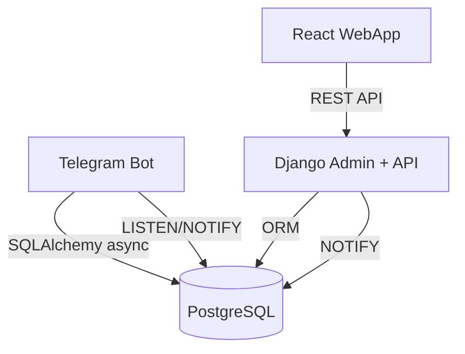

```markdown
# Telegram Shop Bot

Интернет-магазин, работающий в Telegram как полноценное приложение (Mini App). Проект состоит из трёх независимых сервисов, объединённых общей базой данных PostgreSQL.

- **Telegram‑бот (Aiogram 3)** – обеспечивает взаимодействие с пользователями: регистрация, каталог, корзина, оформление заказа, уведомления, администрирование через чат.
- **Django Admin + DRF** – административная панель для управления товарами, заказами, клиентами, рассылками и настройками бота, а также REST API для WebApp.
- **React (TypeScript) WebApp** – встраиваемое приложение, работающее внутри Telegram. Предоставляет современный интерфейс для каталога, корзины, избранного и оформления заказа.

Все сервисы запускаются независимо с помощью Docker Compose.

---

## Архитектура

- **Общая база данных PostgreSQL** – единая схема, используемая Django и ботом.
- **Django** – основное приложение: модели, админка, REST API. При изменении статуса заказа отправляет уведомление через `NOTIFY order_status_changed`.
- **Бот (Aiogram)** – асинхронно работает с БД через SQLAlchemy + asyncpg. Слушает `NOTIFY` для мгновенного оповещения пользователей. Кэширует каналы для проверки подписки.
- **WebApp (React)** – общается с Django API через REST. Авторизация осуществляется по `initData` (проверка подписи). Корзина синхронизируется с ботом через общую БД.
- **Обмен событиями** – при изменении каналов или настроек Django отправляет `NOTIFY channel_changed`, бот инвалидирует кэш.



---

## Технологии

| Сервис       | Технологии                              |
|--------------|-----------------------------------------|
| Telegram Bot | Python 3.12+, Aiogram 3, SQLAlchemy 2.0, asyncpg, alembic |
| Admin Panel  | Python 3.12+, Django 5.2, DRF, mptt, Pillow, openpyxl |
| WebApp       | React 18, TypeScript, Vite, React Router, TanStack Query |
| База данных  | PostgreSQL 15                          |
| Деплой       | Docker, Docker Compose                  |

---

## Запуск проекта

### Требования
- Docker (20.10+) и Docker Compose (2.x)
- Git
- Telegram бот (токен) – создать через [@BotFather](https://t.me/BotFather)

### 1. Клонировать репозиторий
```bash
git clone https://github.com/your-repo/telegram-shop-bot.git
cd telegram-shop-bot
```

### 2. Настроить переменные окружения
Скопировать `.env.example` в `.env` и заполнить обязательные поля:
```bash
cp .env.example .env
# редактировать .env
```

Минимальный набор переменных:
```ini
# PostgreSQL
DB_NAME=shopdb
DB_USER=postgres
DB_PASSWORD=postgres
DB_HOST=postgres
DB_PORT=5432

# Django
DJANGO_SECRET_KEY=your-secret-key
DJANGO_DEBUG=True
DJANGO_ALLOWED_HOSTS=localhost,127.0.0.1,ваш-домен.loca.lt

# Telegram
BOT_TOKEN=ваш_токен_бота

# WebApp и API (для локального тестирования используйте туннель, например ngrok/loca.lt)
WEBAPP_URL=https://ваш-домен.loca.lt
DJANGO_BASE_URL=https://ваш-домен.loca.lt

# CORS
CORS_ALLOWED_ORIGINS=http://localhost:3000,http://127.0.0.1:3000,https://ваш-домен.loca.lt
```

### 3. Запустить контейнеры
```bash
docker-compose up --build
```

Сервисы станут доступны:
- Django: `http://localhost:8000` (админка: `/admin`, логин/пароль из `.env` или создаются автоматически)
- WebApp: `http://localhost:3000` (в браузере; в Telegram открывается через кнопку бота)
- Telegram‑бот: начинает опрашивать обновления (polling)

### 4. Создать суперпользователя (если не создался автоматически)
```bash
docker-compose exec django python manage.py createsuperuser
```

### 5. Настроить бота через админку
- Зайдите в `/admin`
- Добавьте каналы для обязательной подписки в разделе **Channels** (укажите `channel_id` (можно с минусом), название и ссылку-приглашение).
- В разделе **Settings** создайте запись с ключом `admin_chat_id` и значением ID чата (целое число, куда будут приходить уведомления о заказах). ID можно узнать, добавив бота в группу и выполнив `/start` – бот выведет ID в лог.

---

## Структура проекта

```
.
├── docker-compose.yml
├── .env.example
├── README.md
├── bot/
│   ├── Dockerfile
│   ├── requirements.txt
│   ├── app/
│   │   ├── main.py
│   │   ├── config.py
│   │   ├── models.py          # SQLAlchemy модели (повторяют Django)
│   │   ├── database.py
│   │   ├── handlers/          # Обработчики сообщений и callback'ов
│   │   ├── middlewares/       # Регистрация, подписка, логирование
│   │   ├── keyboards/
│   │   ├── states/
│   │   └── utils/
├── django/
│   ├── Dockerfile
│   ├── entrypoint.sh
│   ├── requirements.txt
│   ├── config/
│   │   ├── settings.py
│   │   ├── urls.py
│   │   └── ...
│   └── shop/
│       ├── models.py
│       ├── admin.py
│       ├── api/               # DRF views, serializers, auth
│       ├── signals.py
│       └── migrations/
└── webapp/
    ├── Dockerfile
    ├── nginx/
    ├── package.json
    ├── vite.config.ts
    ├── index.html
    ├── src/
    │   ├── main.tsx
    │   ├── api/
    │   ├── pages/
    │   ├── router/
    │   ├── telegram/          # tma.ts (интеграция с Telegram WebApp)
    │   └── index.css
```

---

## Детали реализации (архитектурные решения)

1. **Общая БД** – позволяет боту и Django работать с одними и теми же данными без синхронизации через API, упрощает поддержку согласованности корзины и заказов.
2. **Асинхронность бота** – все обращения к БД через SQLAlchemy async + asyncpg, что не блокирует event loop aiogram.
3. **Уведомления через PostgreSQL LISTEN/NOTIFY** – Django при изменении статуса заказа или списка каналов отправляет уведомление; бот подписан и реагирует мгновенно. Это быстрее и надёжнее периодического опроса.
4. **Кэширование каналов в боте** – снижает нагрузку на БД; сброс кэша происходит автоматически при изменении каналов через сигнал Django и `NOTIFY`.
5. **Аутентификация WebApp** – используется проверка подписи `initData` с секретным ключом, полученным из `BOT_TOKEN`. Пользователь идентифицируется по `telegram_id` из `initData`.
6. **Изоляция сервисов** – каждый сервис имеет свой Dockerfile и набор зависимостей, может запускаться отдельно.
7. **Гибкие настройки** – бизнес-параметры (каналы, ID админ-чата) хранятся в БД и управляются через админку, без перезапуска бота.

---

## API (кратко)

Эндпоинты для WebApp (все требуют заголовок `Authorization: tma <initData>`):

- `GET /api/categories/` – список категорий (дерево) с полем `has_products`.
- `GET /api/products/` – список товаров (фильтр по `category`, поиск по `search`).
- `GET /api/cart/`, `POST /api/cart/`, `PATCH /api/cart/<id>/`, `DELETE /api/cart/<id>/` – управление корзиной.
- `GET /api/wishlist/`, `POST /api/wishlist/`, `DELETE /api/wishlist/<id>/` – избранное.
- `POST /api/orders/` – создание заказа, `GET /api/orders/` – история, `GET /api/orders/<id>/` – детали.
- `GET /api/auth/me/` – получить данные текущего пользователя.

---

## Функциональные возможности

### Telegram‑бот
- Регистрация с запросом контакта.
- Проверка подписки на каналы (управляется через админку).
- Каталог с категориями и подкатегориями, пагинация, карточка товара с несколькими фото, кнопка открытия WebApp.
- Deep‑linking (ссылки на товары и заказы).
- Корзина (изменение количества, удаление, очистка).
- Оформление заказа через FSM (ФИО, адрес, подтверждение).
- Уведомления о смене статуса заказа.
- Админ-чат: новый заказ отправляется в группу, админы могут менять статус заказа кнопками.
- FAQ через inline‑query.
- Рассылки (создаются в админке, отправляются в фоне).
- Команды: `/start`, `/catalog`, `/cart`, `/wishlist`, `/myorders`, `/help`.

### Django админка
- CRUD категорий (вложенность, MPTT), товаров, изображений.
- Управление клиентами, статистика заказов.
- Фильтрация заказов по статусу, экспорт оплаченных в Excel.
- Управление каналами, настройками (admin_chat_id и др.).
- Создание рассылок (текст + картинка), статусы.

### React WebApp
- Каталог с фильтром по категориям и поиском.
- Корзина (синхронизируется с ботом).
- Избранное.
- Оформление заказа (форма, отправка данных на API, кнопка «Оформить» через MainButton).
- Поддержка BackButton и темы Telegram.
- Адаптивный дизайн, поддержка светлой и тёмной темы.

---

## Автор
Ваше имя / Telegram: @username

Проект выполнен в рамках тестового задания. Все требования технического задания реализованы.
```